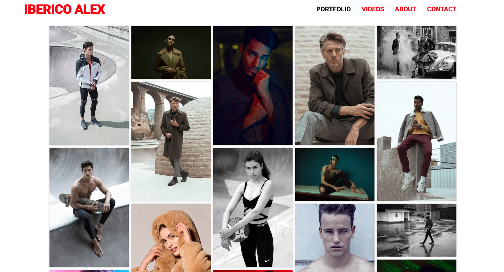
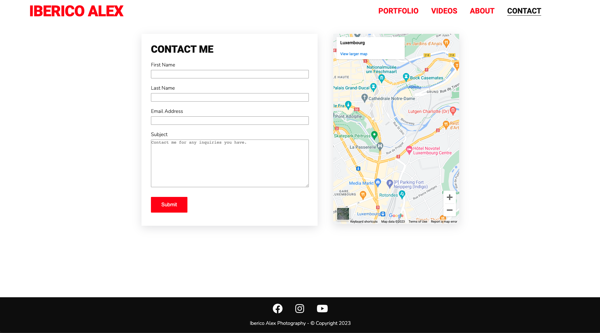

# **Iberico Alex Photography - Portfolio Project 1**

Iberico Alex Photography is a website that represents my own work as a freelance fashion photographer. It serves as a platform for showcasing my portfolio and provides clients with a convenient way to connect with me. With the aim of creating a useful online presence, I have included various features such as a collection of my best photographs, a selection of produced videos, a brief section about myself, and a contact form for clients to inquire about my services.

Live deployment link can be found [here](https://ibericoalex.github.io/iberico-alex-photography/).

# Table of Contents

1. [Project Goals](#project-goals "Project Goals")
2. [User Experience](#user-experience "User Experience")
   - [Target Audience](#target-audience "Target Audience")
   - [User Requirements and Expectations](#user-requirements-and-expectations "User Requirements and Expectations")
   - [User Stories](#user-stories "User Stories")
3. [Design](#design "Design")
   - [Design Choices](#design-choices "Design Choices")
   - [Colour](#colour "Colour")
   - [Fonts](#fonts "Fonts")
   - [Music & Sounds](#music--sounds "Music & Sounds")
   - [Wireframes](#wireframes "Wireframes")
4. [Technologies, Languages & Programs Used](#technologies-languages--programs-used)
5. [Features](#features "Features")
   - [Existing Features](#existing-features "Existing Features")
     - [Start Screen](#start-screen "Start Screen")
     - [Game Screen](#game-screen "Game Screen")
     - [End Screen](#end-screen "End Screen")
   - [Future Features](#future-features "Future Features")
   - [Responsiveness](#responsiveness "Responsiveness")
6. [Testing](#testing "Testing")
   - [Bugs](#bugs "Bugs")
   - [Validator Testing](#validator-testing "Validator Testing")
7. [Deployment, Development & Version Control](#deployment-development--version-control)
8. [Credits](#credits "Credits")

## **User Stories**

As a **user**, I want **to be able to view a consistent colour scheme across the website** so that it **provides a seamless and harmonious browsing experience**.

As a **user**, I want **to be able to find and access the navigation bar** so that I can **navigate effortlessly through the platform**.

As a **user**, I want **to be able to view the footer section** so that I can **find social media links**.

As a **user**, I want **to be able to explore Iberico Alex's work, inclusing both photos and videos** so that I  **can appreciate the artist's talent and style**.

As a **user**, I want **to be able to learn more about the photographer** so that I can **ensure that his background and artistic approach align with my preferences**.

As a **user**, I want **to be able to contact the artist** so that I can **inquire about the services offered**.

## **Design**
For my project, I used my existing [website](https://www.ibericoalex.com/), built with [wix.com](https://www.wix.com/) website builder, as the foundation. The website showcases a bold, minimal, and clean design that perfectly complements my work and artistic perspective.

All the images and videos presented in the project are exclusively captured and owned by me.

### **Colour**
I have chosen bold colors like red, black, and white to represent my artistic brand. These colors not only enhance the visual appeal but also ensure easy readability for users. To generate the color scheme, I utilized [Coolors.co](https://coolors.co/ff0000-0d0d0d-fafafa-525252).

### **Fonts**
I incorporated fonts from [Google Fonts](https://fonts.google.com/) into my website. For the main headers and logo, I selected the font Roboto, while for the body text, I opted for Nunito. These font choices add a stylish and cohesive touch to the overall design.

### **Wireframes**
Before proceeding with any HTML or CSS coding, I made use of Balsamiq to create wireframes for each of the four pages. This step allowed me to envision and solidify the desired visual structure of the changes I intended to implement from my previous website. By establishing a clear blueprint through wireframes, I could confidently proceed with the development process.

- Index/Portfolio page

- Videos page

- About page

- Contact page

## **Technologies, Languages & Programs Used**

* [HTML](https://www.w3schools.com/html/): Markup language for creating web pages.
* [CSS](https://www.w3schools.com/CSS/): Stylesheet language for styling the appearance of web pages.
* [GitHub](https://github.com/): Web-based platform for version control and collaboration on software projects.
* [GitHub Pages](https://pages.github.com/): Hosting service provided by GitHub for publishing static web pages.
* [Google Fonts](https://fonts.google.com/): Library of free and open-source web fonts.
* [Google Lighthouse](https://developer.chrome.com/docs/lighthouse/overview/): Automated tool for auditing and improving web page quality.
* [W3C Validator](https://validator.w3.org/): Tool for checking HTML and CSS code compliance with web standards.
* [CodeAnywhere](https://codeanywhere.com/): Cloud-based integrated development environment (IDE) for coding, collaborating, and deploying projects.
* [VSCode](https://code.visualstudio.com/): Free and highly extensible source code editor with built-in features for editing, debugging, and version control integration. It supports various programming languages and is available for multiple platforms.

## **Features**
### **Common Features**
As the user navigates through the website, the following elements consistently appear across every page. These elements maintain a cohesive presence throughout the user's browsing experience.
 - **Logo and Navigation Bar** 
    - The logo and navigation bar are prominently displayed on every page of the website. These elements have been carefully designed and optimized to ensure seamless functionality across various screen sizes. The logo serves as a clickable link, directing users back to the homepage/portfolio. Additionally, each link within the navigation menu accurately leads users to the corresponding page, enhancing the overall user experience.

    

- **Favicon**
    - The favicon displayed on the browser tab encapsulates the branding of Iberico Alex Photography, providing a small yet impactful visual representation of the website's identity.

    

- **Footer**
    - The footer is consistently visible on every page of the website. It features social media icons that are linked to the corresponding social media platforms, allowing users to easily connect and stay updated with the photographer on these platforms. This enables seamless access to the artist's social media presence and encourages users to stay connected and engaged with their latest updates.

    

### **Homepage/Portfolio**

The landing page serves as the initial entry point for users when they first visit the website. It prominently showcases the portfolio of the photographer, providing a captivating introduction to their body of work.

The photo gallery draws inspiration from the Code Institute Love Running gallery masonry. When hovering over an image, it reduces its opacity to indicate the selected photo. The ultimate goal is to enable image enlargement upon clicking; however, implementing this functionality would require the use of JavaScript.

Additional noteworthy features include:
- The gallery is fully responsive, adjusting the column count based on the screen size for optimal viewing.
- The navigation bar has a visually appealing effect with a blurred transparent background color.
- On smaller screens, the navigation bar adapts by switching to a centered layout, ensuring both the logo and navigation options are displayed in a user-friendly manner.

### **Videos**

The video page features a minimalist layout that places central focus on the curated video. Below the main video, additional videos are displayed as thumbnails, providing easy access to more content. Users can find relevant information about the curated video directly below, allowing them to gain insights and context. This streamlined design ensures a straightforward and immersive video viewing experience.

The ultimate goal is to implement a functionality where clicking on the additional video thumbnails would switch the main video and its accompanying description. However, achieving this functionality would require expertise in JavaScript programming.

### **About**

This page serves as an opportunity for users to delve deeper into the photographer's background and learn more about their artistic journey and expertise.

### **Contact**

The contact page provides users with a convenient means to directly reach out to the photographer and inquire about their services. The contact form, which includes required fields, ensures that all necessary information is correctly filled out.

The embedded Google Maps feature enables users to easily locate and identify the precise geographical location where the photographer is based. This provides users with a convenient way to get a visual representation of the photographer's physical presence and facilitates better understanding of their location.

## **Testing**

Testing available [here](./TESTING.md)

## **Deployment, Development & Version Control**

The development environment used for this project was VSCode, GitPod and CodeAnywhere.

Each software developer on the team created their own individual branch divergent from main from the get-go and have communicated via Slack to collaborate, pitch ideas, fix bugs and talk about relevant Pull Requests. Regular commits and pushes to Github have been employed to be able to track and trace the development process of the web application.

For local deployments instructions shall be written below, along with instructions with deployment to GitHub Pages, the hosting service used to deploy this particular website.

### **Local Deployment**

This repository can be cloned and run locally with the following steps:

- Login to GitHub.
- Select repository named: keironchaudhry/june-pride-hackathon-2023
- Click code toggle button and copy the url (i.e., https://github.com/keironchaudhry/june-pride-hackathon-2023.git).
- In your IDE, open the terminal and run the git clone command (i.e., git clone https://github.com/keironchaudhry/june-pride-hackathon-2023.git). The repository will now be cloned in your workspace.

### **Deployment to GitHub**

The live version of the project is deployed at GitHub pages.

The procedure for deployment followed the "Creating your site" steps provided in GitHub Docs.

- Log into Github.
- Select desired GitHub Repository to be deployed live.
- Underneath the repository name, click the “Settings” option.
- In the sub-section list on the left, under “Code and automation”, click “Pages”.
- Within the ”Source” section choose ”main” as Branch and root as folder and click ”Save”.
- The page refreshes and a website shall then deploy via a link.
- The following is the live link deployed: 

## **Credits**

### **Acknowledgments**

This project was created in collaboration by [Team Symbiotic+](https://hackathon.codeinstitute.net/teams/314/): [Hermon Asmelash](https://github.com/Hasmelash95), [Iberico Alex](https://github.com/ibericoalex), [Keiron Chaudhry](https://github.com/keironchaudhry), [Stephen Opoku](https://github.com/Stephenkofipoku), [Sam Petchey](https://github.com/sampetchey), [Samuel Ukachukwu](https://github.com/SamuelUkachukwu).
